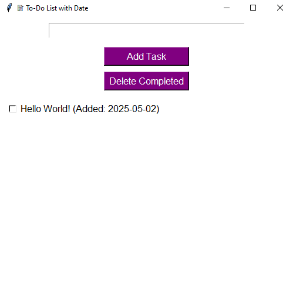

# ✅ To-Do List App (with Date Display)

A simple and stylish Python Tkinter-based To-Do List application that allows you to:

- Add tasks with auto-generated creation dates
- Mark tasks as complete
- Delete completed tasks
- Save/load tasks using a JSON file

---

## 🌟 Features
- ✅ Add new tasks
- 📅 Auto-show task creation date
- ☑️ Mark tasks as done
- 🗑️ Delete completed tasks
- 🧠 Saves your data even after you close the app

---

## 🖼️ Screenshot



---

## 💻 Technologies Used

- Python 🐍
- Tkinter (GUI)
- JSON (for local storage)
- `datetime` (for auto-dating tasks)

---
## 🧑‍💻 Author
Made with 💜 TAIBA-RIAZ

## 🚀 How to Run the App

### 1. Clone the Repository
```bash
git clone https://github.com/TAIBA-RIAZ/to-do-list-app.git
cd to-do-list-app

